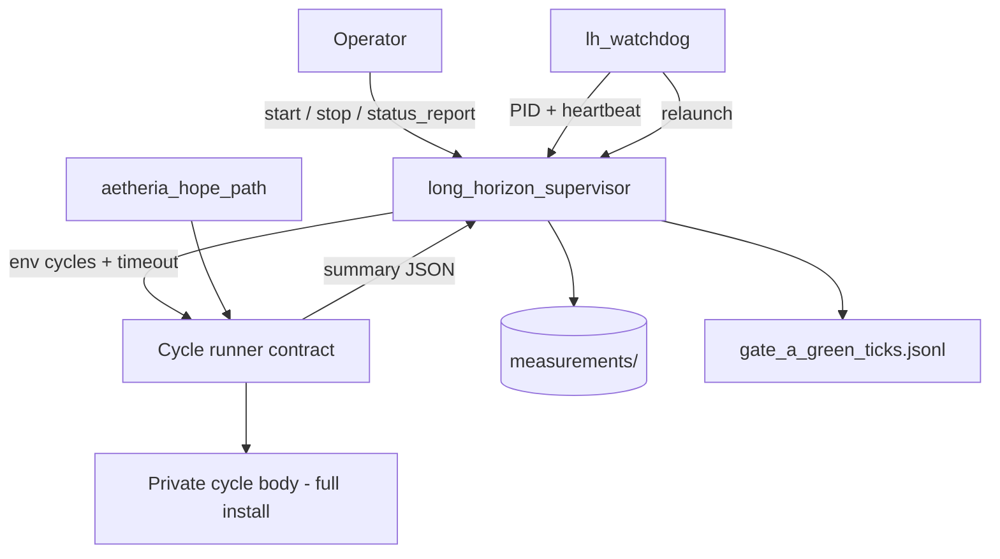

# Aetheria Sovereign Agent

[](https://github.com/denisrigsby/Aetheria-sovereign-agent/actions/workflows/ci.yml)
[](LICENSE)
[](https://www.python.org/downloads/)
[](https://github.com/denisrigsby/Aetheria-sovereign-agent/releases)

**Local multi-cycle agent runtime with process supervision, on-disk continuity, and a contracted cycle runner.**

Run bounded autonomous work on a schedule — without using a chat window or IDE session as the parent process. A lightweight supervisor drives ticks, a cycle worker reports success through a structured contract, state lands on disk, and a watchdog recovers from crashes and stalls.

> Think **supervisor / pm2 for agent work loops**, with restart-safe progress accounting and explicit cycle completion — not log scraping as the primary API.

## Why this exists

Long-running local AI work often dies with the interactive session that started it. Context lives in chat. Restarts mean starting over. “Just leave it running” can turn into multi-hour hangs under unbounded manage/recon paths.

Aetheria’s published control plane answers that with:

1. A **detached plant clock** (long-horizon supervisor)  
2. A **watchdog** that relaunches on death or stall  
3. A **cycle runner contract** (structured summary, env-based cycle count, hard timeouts)  
4. **Rolling process segments** (default 48 ticks — multi-PID campaigns are normal)  
5. **Restart-resilient green-tick logs** for optional change-control gates  
6. **Operator tooling** to spot lag (orphan workers, memory, CPU) in one command  

Private runtime pieces (orchestrator, living memory, asset registry) stay on the operator machine. This repository is the **auditable control plane**.

**Not in this repo (private operator depth):** interactive companion chat, local generative backends, fine-tune / adapter train loops. If present locally, they must **never parent** the long-horizon plant clock.

→ Deep dive: [docs/WHY.md](docs/WHY.md) · [docs/CYCLE_RUNNER.md](docs/CYCLE_RUNNER.md)

## Features

| Feature | Description |
|---------|-------------|
| **Supervised tick loop** | Scheduled multi-cycle work with on-disk checkpoints |
| **Cycle runner contract** | `lh_probe_summary_v1` JSON; env `AETHERIA_NUM_CYCLES`; dual-read fallback |
| **Bounded finalize** | After contract success, short grace then terminate hang-prone tails |
| **Watchdog recovery** | Relaunch on death, stall, or segment completion |
| **PID-truth relaunch** | Success = live supervisor PID (poll), not only a fast launcher return |
| **Rolling segments** | Default **48 ticks** per process — not single-PID heroics |
| **Durable green ticks** | Gate progress survives process restart |
| **Measured entry path** | `aetheria_hope_path` for health + short runs |
| **Momentum carry** | Progress signals can continue across restarts |
| **Conservation defaults** | Light manage + selective heavy health |
| **Status + resource hygiene** | `status_report` / `resource_check` — orphans, RAM, CPU, segment vs campaign |
| **Bounded smoke runner** | `run_probe_bounded` — no unbounded manual probes |
| **Guarded edit sandbox** | Disposable SafeEdit demo target |
| **Plant != chat** | Detached ticks; interactive sessions never own the schedule |

## Architecture



| Layer | Owns | Does not own |
|-------|------|----------------|
| Operator | Intent, rare review | Multi-hour parent process |
| Control plane (this repo) | Schedule, recovery, contracts, status | Private memory contents |
| Private runtime | Cycle implementation, registry, living streams | Public distribution |

## Try the local demo (sanitized) — start here

**High-signal path for clones:** prove the control plane works locally without private sauce.

```powershell
git clone https://github.com/denisrigsby/Aetheria-sovereign-agent.git
cd Aetheria-sovereign-agent
python -u scripts/demo_local_smoke.py
# Windows one-click:
#   Demo-Local.bat
#   or: powershell -File scripts/demo_local.ps1
```

| Demo includes | Demo does **not** include |
|---------------|---------------------------|
| Layout + compile smoke | Private living streams / registry guts |
| Example measurement shapes | Companion chat / Ollama surface |
| Clear plant ≠ chat warnings | Live G4 train / adapters |
| Soft status import probe | Auto-started multi-hour plant |

Full doc: **[docs/PUBLIC_DEMO.md](docs/PUBLIC_DEMO.md)**.  
Private depth (if you have a full operator root) must **never** parent the plant from chat.

## Quick start

```powershell
git clone https://github.com/denisrigsby/Aetheria-sovereign-agent.git
cd Aetheria-sovereign-agent
```

**Conservation environment** (recommended for long runs):

```powershell
$env:AETHERIA_LIGHT_MANAGE = "1"
$env:AETHERIA_SKIP_FINAL_RECON = "1"
$env:AETHERIA_HEAVY_HEALTH_CYCLES = "6,12"
$env:AETHERIA_META_RECON = "0"
```

**Status / lag check** (always safe, read-only unless reaping):

```powershell
python -u scripts/status_report.py
# If ORPHAN_PROBES while plant is idle:
python -u scripts/status_report.py --reap-orphans
```

**Short measured run** (full install required for cycle body):

```powershell
python -u scripts/aetheria_hope_path.py --health-only
python -u scripts/aetheria_hope_path.py --cycles 2
```

**Detached schedule + watchdog** (rolling segment defaults):

```powershell
powershell -File scripts/launch_long_horizon.ps1 -Cycles 2 -IntervalMin 30 -MaxTicks 48
powershell -File scripts/launch_lh_watchdog.ps1
```

**Manual cycle smoke** (hard timeout — prefer this over bare probe scripts):

```powershell
python -u scripts/run_probe_bounded.py --cycles 2
```

**Stop:**

```powershell
Set-Content measurements/long_horizon_STOP "stop"
Set-Content measurements/watchdog_STOP "stop"
```

> **Scope:** Clones of this repo alone are the control plane. The cycle body and registry resolve inside a complete local Aetheria root. That split is intentional.

## Repository layout

```
scripts/        Supervisor, watchdog, hope path, cycle contract consumers,
                status/resource hygiene, bounded runner, gate eval, sandbox edit
living/         Path helpers + disposable sandbox target
measurements/   Examples and schemas only (not live host state)
templates/      Example handoff / resume shapes
docs/           Why, architecture, cycle runner, operations, internals
```

## Documentation

| Document | Description |
|----------|-------------|
| [docs/PUBLIC_DEMO.md](docs/PUBLIC_DEMO.md) | **Sanitized try-it-now demo** (clones) |
| [docs/WHY.md](docs/WHY.md) | Problem, non-goals, success criteria |
| [docs/CYCLE_RUNNER.md](docs/CYCLE_RUNNER.md) | Cycle contract, timeouts, orphan hygiene |
| [docs/ARCHITECTURE.md](docs/ARCHITECTURE.md) | Layers and components |
| [docs/OPERATIONS.md](docs/OPERATIONS.md) | Start, stop, recover, maintenance |
| [docs/INTERNALS.md](docs/INTERNALS.md) | Continuity files and change policy |
| [docs/MEMORY_AND_STATE.md](docs/MEMORY_AND_STATE.md) | Public vs private boundary |
| [docs/HYGIENE.md](docs/HYGIENE.md) | Public hygiene PR policy |
| [SETUP.md](SETUP.md) | Requirements and smoke tests |
| [CHANGELOG.md](CHANGELOG.md) | Release history |
| [CONTRIBUTING.md](CONTRIBUTING.md) | What belongs in PRs |
| [SECURITY.md](SECURITY.md) | Vulnerability reporting |

## Status

| Area | State |
|------|--------|
| Light multi-cycle + supervision | **Stable** |
| Cycle runner contract (summary + env cycles) | **Stable** (parent consumers published) |
| Watchdog relaunch (PID-truth) | **Stable** |
| Rolling segments (default 48) | **Stable** |
| Durable green-tick / change gate | **Stable** |
| Status + orphan/resource hygiene | **Stable** |
| Guarded sandbox edit | **Demonstrated** |
| Broad auto-edit of production modules | **Incomplete** (not claimed) |
| Private cycle body / living / registry | **Not published** |

## What this repository is not

- Not a hosted multi-tenant agent cloud  
- Not a dump of private memory, registries, or host paths  
- Not a claim that full autonomous production-code editing is finished  
- Not “chat as the long-run parent”

## Contributing

Bugfixes and documentation improvements to the published scripts are welcome.  
Do **not** open PRs that include living dumps, registries, credentials, host absolute paths, or operator-private notes.

See [CONTRIBUTING.md](CONTRIBUTING.md).

## License

[MIT](LICENSE) © 2026 Denis Rigsby / Aetheria Project
