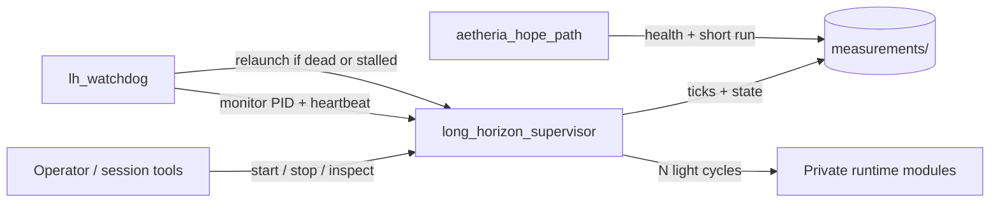

# Aetheria Sovereign Agent

[](https://github.com/denisrigsby/Aetheria-sovereign-agent/actions/workflows/ci.yml)
[](LICENSE)
[](https://www.python.org/downloads/)

**Local multi-cycle agent runtime with built-in supervision and persistence.**

Run bounded autonomous work on a schedule — without keeping a chat window or interactive session alive. A lightweight supervisor executes cycles, persists state to disk, and a watchdog ensures recovery. Designed for reliable, long-horizon local AI agents.

> Think process supervision (supervisor / pm2) for agent work loops: start it, leave it, resume after restarts.

## Why this exists

Interactive AI sessions are poor parents for multi-hour work. They disconnect, rate-limit, and forget. Aetheria separates:

| Role | Responsibility |
|------|----------------|
| **Operator** | Goals, constraints, occasional review |
| **Control plane** (this repo) | Detached supervisor, watchdog, measured entry path |
| **Private runtime** (local install) | Orchestrator, memory streams, asset registry |

The public surface is the **control plane** — scripts and docs you can audit, run, and extend. Deployment-specific state stays on the operator machine.

## Features

- **Supervised process loop** — scheduled ticks with on-disk checkpoints
- **Watchdog recovery** — relaunch on crash, exit, or stalled tick
- **Measured health path** — short smoke runs and status JSON
- **Momentum tracking** — progress signals survive process restarts
- **Conservative defaults** — light manage + selective heavy health (avoids multi-hour stalls)
- **Guarded edit sandbox** — demo target for safe string edits with backup

## Architecture (control plane)



## Quick start

```powershell
git clone https://github.com/denisrigsby/Aetheria-sovereign-agent.git
cd Aetheria-sovereign-agent
```

**Recommended stable environment** (use these unless you are deliberately stress-testing failure modes):

```powershell
$env:AETHERIA_LIGHT_MANAGE = "1"
$env:AETHERIA_SKIP_FINAL_RECON = "1"
$env:AETHERIA_HEAVY_HEALTH_CYCLES = "6,12"
$env:AETHERIA_META_RECON = "0"
```

**Short measured run** (requires a full local install root — see [SETUP.md](SETUP.md)):

```powershell
python -u scripts/aetheria_hope_path.py --health-only
python -u scripts/aetheria_hope_path.py --cycles 2
```

**Detached multi-cycle schedule + watchdog:**

```powershell
powershell -File scripts/launch_long_horizon.ps1 -Cycles 2 -IntervalMin 30 -MaxTicks 200
powershell -File scripts/launch_lh_watchdog.ps1
```

**Stop:**

```powershell
Set-Content measurements/long_horizon_STOP "stop"
Set-Content measurements/watchdog_STOP "stop"
```

> **Note:** This repository alone is the control plane. Imports for the orchestrator and registry resolve only when placed into (or copied onto) a complete Aetheria root. That split is intentional.

## Repository layout

```
scripts/           Supervisor, watchdog, hope path, hygiene, sandbox edit
living/            Path helpers + disposable sandbox edit target
measurements/      Example status artifacts (not live host state)
templates/         Example handoff / resume shapes
docs/              Architecture, operations, internals
```

## Documentation

| Doc | Contents |
|-----|----------|
| [SETUP.md](SETUP.md) | Requirements, env, smoke test |
| [docs/ARCHITECTURE.md](docs/ARCHITECTURE.md) | Process model and components |
| [docs/OPERATIONS.md](docs/OPERATIONS.md) | Day-2 runbook: start, stop, recover |
| [docs/INTERNALS.md](docs/INTERNALS.md) | Expected tree, continuity files, change policy |
| [docs/MEMORY_AND_STATE.md](docs/MEMORY_AND_STATE.md) | What is private vs published |
| [HIGH_LEVEL_DESCRIPTION.md](HIGH_LEVEL_DESCRIPTION.md) | Elevator summary |
| [CONTRIBUTING.md](CONTRIBUTING.md) | How to contribute safely |

## Status

| Area | State |
|------|--------|
| Light multi-cycle + supervision | **Stable** — actively used on a local production setup |
| Watchdog relaunch | **Stable** |
| Guarded sandbox edit | **Demonstrated** |
| Broad auto-edit of production modules | **Incomplete** (not claimed) |
| Living memory / live registries | **Private** — not published |

## Topics

`process-supervision` · `local-ai` · `agent-runtime` · `reliability` · `watchdog` · `persistent-agents`

## Contributing

Bugfixes and documentation improvements to the published scripts are welcome.  
**Do not** open PRs that include living dumps, registries, credentials, host paths, or operator-only notes.

See [CONTRIBUTING.md](CONTRIBUTING.md).

## License

[MIT](LICENSE) © 2026 Denis Rigsby / Aetheria Project
