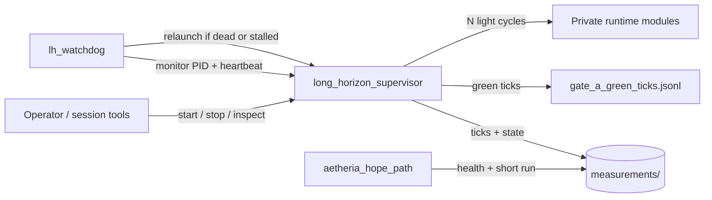

# Aetheria Sovereign Agent

[](https://github.com/denisrigsby/Aetheria-sovereign-agent/actions/workflows/ci.yml)
[](LICENSE)
[](https://www.python.org/downloads/)
[](https://github.com/denisrigsby/Aetheria-sovereign-agent/releases)

**Local multi-cycle agent runtime with process supervision and on-disk persistence.**

Run bounded autonomous work on a schedule — without keeping a chat window or interactive session as the parent process. A lightweight supervisor executes ticks, checkpoints state to disk, and a watchdog recovers from crashes and stalls. Built for reliable, long-horizon **local** AI agents.

> Process supervision (in the spirit of supervisor / pm2) for agent work loops: start it, leave it, resume after restarts.

## Why this exists

Interactive AI sessions are poor parents for multi-hour work. They disconnect, rate-limit, and lose context. This project separates:

| Role | Responsibility |
|------|----------------|
| **Operator** | Goals, constraints, occasional review |
| **Control plane** (this repository) | Detached supervisor, watchdog, measured entry path, continuity helpers |
| **Private runtime** (full local install) | Orchestrator, memory streams, asset registry |

The published surface is the **control plane** — scripts and documentation you can audit and reuse. Deployment-specific memory and registries stay on the operator machine and are **not** distributed here.

## Features

- **Supervised tick loop** — scheduled multi-cycle work with on-disk checkpoints  
- **Watchdog recovery** — relaunch when the supervisor dies, stalls, or exits a segment  
- **Honest relaunch detection** — success when the supervisor PID is alive, not only when a launcher returns quickly  
- **Rolling segments** — default **48 ticks** per process (not a single endless PID as the unit of success)  
- **Restart-resilient green-tick accounting** — durable log so change-control gates survive process restart  
- **Measured entry path** — short health / cycle smoke runs via `aetheria_hope_path`  
- **Momentum carry** — progress signals can continue across restarts  
- **Conservative defaults** — light manage + selective heavy health (reduces multi-hour stalls)  
- **Guarded edit sandbox** — disposable target for safe string-edit demos  
- **Read-only continuity audit** — `verify_continuity_readonly.py`  

## Architecture



See [docs/ARCHITECTURE.md](docs/ARCHITECTURE.md) for the full model.

## Quick start

```powershell
git clone https://github.com/denisrigsby/Aetheria-sovereign-agent.git
cd Aetheria-sovereign-agent
```

**Recommended conservation environment** (stable defaults for long runs):

```powershell
$env:AETHERIA_LIGHT_MANAGE = "1"
$env:AETHERIA_SKIP_FINAL_RECON = "1"
$env:AETHERIA_HEAVY_HEALTH_CYCLES = "6,12"
$env:AETHERIA_META_RECON = "0"
```

**Short measured run** (requires a full local install root — see [SETUP.md](SETUP.md)):

```powershell
python -u scripts/aetheria_hope_path.py --health-only
python -u scripts/aetheria_hope_path.py --cycles 2
```

**Detached schedule + watchdog** (rolling segment defaults):

```powershell
powershell -File scripts/launch_long_horizon.ps1 -Cycles 2 -IntervalMin 30 -MaxTicks 48
powershell -File scripts/launch_lh_watchdog.ps1
```

**Stop:**

```powershell
Set-Content measurements/long_horizon_STOP "stop"
Set-Content measurements/watchdog_STOP "stop"
```

**Status / continuity** (read-only):

```powershell
python -u scripts/status_report.py
python -u scripts/verify_continuity_readonly.py
```

> **Scope note:** This repository is the control plane. Orchestrator and registry imports resolve when the scripts live inside (or are overlaid onto) a complete Aetheria root. That split is intentional.

## Repository layout

```
scripts/        Supervisor, watchdog, hope path, gate eval, continuity audit, hygiene, sandbox edit
living/         Path helpers + disposable sandbox edit target
measurements/   Example / schema artifacts only (not live host state)
templates/      Example handoff and resume shapes
docs/           Architecture, operations, internals
```

## Documentation

| Document | Description |
|----------|-------------|
| [docs/WHY.md](docs/WHY.md) | Why this exists — problem, non-goals, success criteria |
| [SETUP.md](SETUP.md) | Requirements, environment, smoke tests |
| [docs/ARCHITECTURE.md](docs/ARCHITECTURE.md) | Process model and components |
| [docs/OPERATIONS.md](docs/OPERATIONS.md) | Start, stop, recover, maintenance |
| [docs/INTERNALS.md](docs/INTERNALS.md) | Continuity files, health definition, change policy |
| [docs/MEMORY_AND_STATE.md](docs/MEMORY_AND_STATE.md) | Public vs private state boundary |
| [HIGH_LEVEL_DESCRIPTION.md](HIGH_LEVEL_DESCRIPTION.md) | Elevator summary |
| [CHANGELOG.md](CHANGELOG.md) | Release history |
| [CONTRIBUTING.md](CONTRIBUTING.md) | What belongs in this repository |
| [SECURITY.md](SECURITY.md) | Vulnerability reporting |

## Status

| Area | State |
|------|--------|
| Light multi-cycle + supervision | **Stable** |
| Watchdog relaunch (PID-truth) | **Stable** |
| Rolling segments (default 48 ticks) | **Stable** |
| Durable green-tick / change gate | **Stable** |
| Guarded sandbox edit | **Demonstrated** |
| Broad automatic editing of production modules | **Incomplete** (not claimed) |
| Living memory / live registries | **Private** — not published |

## What this repository is not

- Not a hosted multi-tenant agent cloud  
- Not a dump of private memory, registries, or host paths  
- Not a claim that full autonomous self-modification is finished  

## Contributing

Bugfixes and documentation improvements to the published scripts are welcome.  
Do **not** open pull requests that include living dumps, registries, credentials, host absolute paths, or operator-private notes.

See [CONTRIBUTING.md](CONTRIBUTING.md).

## License

[MIT](LICENSE) © 2026 Denis Rigsby / Aetheria Project
