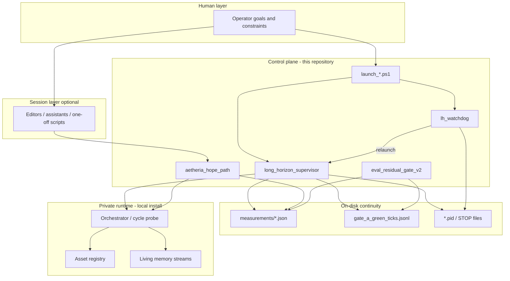

# Architecture

## Design goal

Interactive sessions are unreliable parents for multi-hour agent work. Aetheria splits responsibilities so long-running loops outlive any single chat or IDE session.

## Layers

| Layer | Owns | Must not own |
|-------|------|----------------|
| Operator | Intent, rare approvals | Multi-hour parent process |
| Session tooling | Implement / repair while available | Detached tick schedule |
| Control plane | Process life cycle, status files, change gates | Private memory contents |
| Private runtime | Cycles, registry, living streams | Public GitHub distribution |

## Control-plane components

### `long_horizon_supervisor`

On each tick:

1. Ensure registry presence (or restore from backup when available)  
2. Run light health  
3. Execute N light cycles via the local probe  
4. Record momentum and completion to `measurements/`  
5. Append durable green-tick records when the tick succeeds  
6. Sleep until the next interval (honors a stop file during sleep)  

Default segment length is **48 ticks** (configurable). Completing a segment is expected; a new process may continue the campaign.

### `lh_watchdog`

Separate process. Monitors:

- Supervisor PID liveness  
- Heartbeat freshness  
- Stuck `running_tick` beyond a threshold  
- Clean exit after max ticks (optional relaunch)  

Relaunches through the launch script. **Relaunch success** is defined by a live supervisor PID (with polling), not solely by a fast PowerShell return code. Writes `measurements/watchdog_status.json` and may write an optional operator notify file.

### `aetheria_hope_path`

Measured entry path: health reporting, optional hygiene/backup, short N-cycle run, updates `measurements/hope_status.json`.

### Change-control gate (`eval_residual_gate_v2`)

Optional evaluator for “has enough green work completed since the last recorded change?” Gate A uses both in-process history and the durable green-tick log so process restarts do not erase progress.

### Guarded edit (sandbox)

When the orchestrator is present, exact string edits can run with backup and uniqueness checks. Published exercise target: `living/m6_sandbox_target.py`.

## Conservation defaults

| Variable | Suggested | Intent |
|----------|-----------|--------|
| `AETHERIA_LIGHT_MANAGE` | `1` | Prefer light cycle manage |
| `AETHERIA_SKIP_FINAL_RECON` | `1` | Skip thrash recon tails |
| `AETHERIA_HEAVY_HEALTH_CYCLES` | `6,12` | Heavier health only on selected indices |
| `AETHERIA_META_RECON` | `0` | Disable meta-recon by default |

Unbounded full-manage paths have produced multi-hour stalls in testing; conservation defaults are intentional.

## Campaign vs process

| Concept | Meaning |
|---------|---------|
| **Process / segment** | One supervisor PID, default max 48 ticks |
| **Campaign** | Durable multicycle work across segments (momentum, gates, registry) |

Success is continuity of the campaign, not heroics of a single PID.
