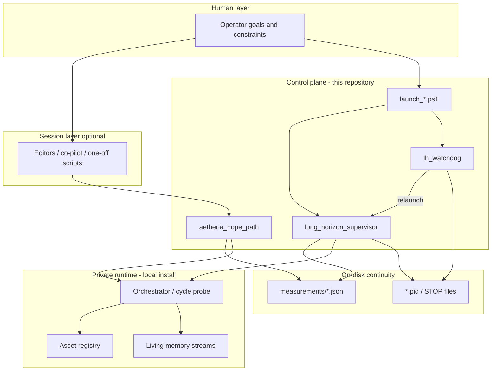

# Architecture

## Design goal

Interactive sessions are unreliable parents for multi-hour agent work. Aetheria splits responsibilities so long-running loops outlive any single chat or IDE session.

## Layers

| Layer | Owns | Must not own |
|-------|------|----------------|
| Operator | Intent, rare approvals | Multi-hour parent process |
| Session tooling | Implement / repair while available | Detached tick schedule |
| Control plane | Process life cycle, status files | Private memory contents |
| Private runtime | Cycles, registry, living streams | Public GitHub distribution |

## Control-plane components

### `long_horizon_supervisor`

On each tick:

1. Ensure registry presence (or restore from backup when available)
2. Run light health
3. Execute N light cycles via the local probe
4. Record momentum and completion to `measurements/`
5. Sleep until the next interval (honors a stop file during sleep)

### `lh_watchdog`

Separate process. Monitors:

- Supervisor PID liveness
- Heartbeat freshness
- Stuck `running_tick` beyond a threshold
- Clean exit after max ticks (optional relaunch policy)

Relaunches through the launch script. Writes `measurements/watchdog_status.json`.

### `aetheria_hope_path`

Measured entry path: health reporting, optional hygiene/backup, short N-cycle run, updates `measurements/hope_status.json`.

### Guarded edit (sandbox)

When the orchestrator is present, exact string edits can run with backup and uniqueness checks. Published exercise target: `living/m6_sandbox_target.py` via `scripts/m6_thin_safeedit.py`.

## Conservation defaults

Unbounded full-manage and aggressive recon paths produced multi-hour stalls in testing. Defaults favor:

| Variable | Suggested | Intent |
|----------|-----------|--------|
| `AETHERIA_LIGHT_MANAGE` | `1` | Prefer light cycle manage |
| `AETHERIA_SKIP_FINAL_RECON` | `1` | Skip thrash recon tails |
| `AETHERIA_HEAVY_HEALTH_CYCLES` | `6,12` | Heavier health only on selected indices |
| `AETHERIA_META_RECON` | `0` | Disable meta-recon by default |

## What this architecture is not

- Not a hosted multi-tenant agent SaaS
- Not a claim that broad autonomous production-code editing is complete
- Not a dump of private living memory or registries
